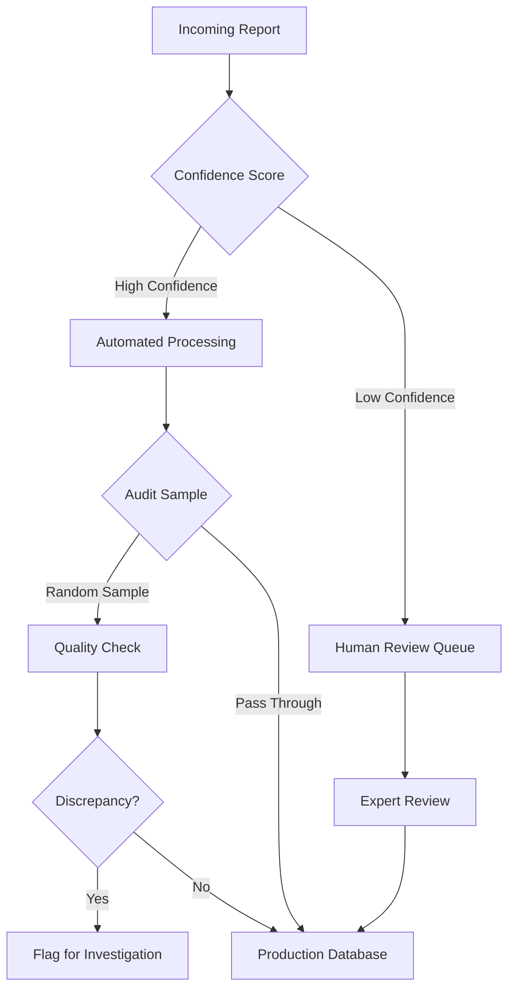

## Introduction

The gap between a Jupyter notebook and a hospital server is not just a matter of deployment engineering—it's a fundamental difference in objectives.

Machine learning researchers are trained to chase the upper bounds of performance metrics. We want the highest F1-score, the lowest perplexity, or the best position on the HuggingFace leaderboard. But at the British Columbia Cancer Registry (BCCR), where our team processes thousands of pathology reports to track cancer incidence and patient outcomes, we learned that a "perfect" model can still fail to solve the actual problem<d-cite key="gondara2023classifying,gondara2024detecting"></d-cite>.

Over four years, we deployed various NLP models—from simple regex patterns to fine-tuned BERT models to large language models—for tasks including tumor reportability classification, cancer relapse detection, and report segmentation. This is the unvarnished reality of what worked, what didn't, and why the gap between research and production is wider than most people think.

## The Metric Trap

In a standard classification task, we define success as maximizing accuracy, F1-score, or Area Under the Curve. But in a production registry pipeline, **the cost functions are asymmetric and tied to human labor**, not model metrics.

Consider our task of reportable tumor identification—determining which pathology reports contain cancers that must be tracked by the registry.

**The Academic Goal:** Maximize F1-score by balancing precision and recall.

**The Reality:** Every "Positive" prediction triggers a manual review by a highly trained tumor registrar. Every "Negative" is archived. If a model has high recall but moderate precision, it floods registrars with false alarms, creating burnout and backlogs.

We discovered that the metric that actually mattered was **time saved per report**. Let me show you the math from our deployment. In the manual process, we had 1,000 true positives and 400 false positives, totaling 1,400 reviews at 1 minute each—that's 1,400 minutes of work. The NLP tool marks up the sentences explaining why the report is flagged as reportable. Thus, a tumor registrar instead of spending 1 minute to read one report may now only need to spend 30 seconds on it. With the tool, human experts spend 550 minutes to process 1,400 reports, compared to 1,400 minutes without it.

This revealed something counterintuitive: **A model with lower theoretical accuracy that integrates better into the human-in-the-loop process is more valuable than a SOTA model that disrupts the workflow.** The key was not just filtering cases but highlighting evidence—extracting specific sentences that explained the decision, cutting per-report review time in half.

A real example from BCCR: discussions between subject matter experts and ML experts led to the creation of an NLP solution that minimizes false positives while keeping false negatives below 2%. This shows that strategic alignment of projects is fundamental to realizing business value and achieving desired outcomes.

The lesson here is simple: don't just optimize for accuracy. Optimize for the workflow. ML experts measure model success by false negatives, false positives, and area under the ROC curve. But to an organization, the success of a solution based on a model is measured by other metrics such as time saved, backlog reduction, or improved data quality.

## Do Not Use a Cannon to Kill a Fly

With all the hype surrounding Generative AI, there's enormous pressure to throw an LLM at every text processing problem. **We found this to be computationally wasteful and often less effective than simpler methods.**

We advocate for a **pragmatic hybrid architecture**—a waterfall approach where data flows through progressively more sophisticated models.



    Figure 1: Our pragmatic hybrid architecture processes reports through layers of increasing sophistication, reserving expensive models for genuinely difficult cases.

**Layer 1: Regular Expressions (The "Boring" Layer)**

For structured data like dates, histology codes, or tumor staging notation, regex provides 100% precision and zero hallucinations. It's fast, cheap, and explainable. Extracting "Grade 3" from "Histologic grade: 3/3" requires no machine learning.

**Layer 2: Specialized BERT Models (The "Efficient" Layer)**

For classification tasks requiring semantic understanding, a fine-tuned ClinicalBERT or PubMedBERT is vastly more efficient than prompting larger LLMs<d-cite key="lee2020biobert,alsentzer2019publicly"></d-cite>. Smaller domain-specific models often outperform general-purpose LLMs on focused tasks while costing a fraction of the computational budget.

**Layer 3: LLMs (The "Smart" Layer)**

We reserve GenAI for ambiguous cases, summarization, or extracting nuanced entities where context is key. This represents a small fraction of our cases but handles scenarios where simpler methods fail.

**The Unsung Hero: Report Segmentation**

Pathology reports are full of noise: headers, disclaimers, clinical history. Using a lightweight model to segment the report and feed only the "Diagnosis" section to downstream models improved performance more than simply scaling up model size. Report segmentation is the unsung hero—preprocessing matters more than model size.

The lesson: model selection should be pragmatic, not trendy. Match the complexity of the method to the complexity of the problem. Don't use a cannon to kill a fly.

## Data Quality is Everything

In academic datasets, the labels are provided. In healthcare, **labels must be created, often by the same experts you're trying to automate.** We found that label noise was a massive bottleneck.

### The Fix: Consensus-Based Code Books

We moved away from single-annotator workflows to a consensus-based approach. We spent weeks strictly defining annotation guidelines before training a single model. This required facilitated sessions with senior registrars to discuss edge cases, create precise definitions for each label, and establish decision trees for ambiguous scenarios.

The result was high inter-annotator agreement. If humans can't agree on the label, the model has no chance.

### Data Drift is Real

Medical terminology, reporting formats, and clinical practices all evolve<d-cite key="finlayson2021clinician"></d-cite>. A model trained on 2019 pathology reports can struggle with 2022 reports that use newer terminology and different formats.



    Figure 2: Model performance degrades over time as medical terminology and reporting practices evolve without continuous monitoring and retraining.

Our solution involved automated drift detection, continuous monitoring of prediction distributions and confidence scores, and periodic retraining incorporating recent examples. The fundamental lesson: in healthcare settings, data quality and representativeness matter more than model sophistication. A simpler model trained on high-quality, representative data will outperform a complex model trained on poor data.

## Error Handling as System Design

No model is perfect. In healthcare, this is especially critical because **errors have consequences**. We learned that how you handle errors matters more than eliminating them entirely.

Our approach involved multiple layers: confidence-based routing where low-confidence predictions are flagged for human review, human-in-the-loop validation with registrars reviewing a sample of automated decisions regularly, continuous auditing adapted from clinical trial design principles<d-cite key="gondara2024auditing"></d-cite>, and graceful degradation where the model defaults to manual review when encountering unusual cases.

    Figure 3: Multi-layer error mitigation pipeline combining confidence-based routing, human-in-the-loop validation, and continuous auditing.

### Asymmetric Error Costs

Not all errors are equal. For our reportable tumor classification task, we designed the system to minimize false positives while keeping false negatives below 2%. This alignment came directly from understanding operational costs: false positives waste staff time but are caught quickly during review, while false negatives could mean missed cancer cases, which is unacceptable.

The lesson: accept that errors will happen and design your system to handle them gracefully. Confidence thresholds, human-in-the-loop validation, and continuous monitoring are essential for reliable healthcare AI systems.

## Co-Design or Fail

We had a significant advantage: we are the provincial cancer registry. Our team includes both ML researchers and tumor registrars, with direct access to oncologists for decisions requiring deeper clinical expertise. This internal collaboration was critical to our success.

We started by deeply understanding our registrars' workflows, timing each step and identifying pain points. We ran structured discussions about what actually helps: What takes the most time? Where do errors happen? What would make their job easier?



    Figure 4: Successful deployment required alignment across multiple groups within the registry, each with different priorities and expertise.

During our co-design sessions, we almost made a critical error. Our initial goal was: **"Create an NLP solution that is at least 99% accurate for identifying reportable tumors."** This solely focuses on accuracy and lacks specificity.

A senior registrar reframed the problem: "We need to reduce the 24-month backlog. Can your model help with that?"

This changed everything. We pivoted to: **"Address the existing two-year backlog in pathology coding by automating reportable tumor identification in a way that achieves accuracy similar to current processes while reducing manual review time by at least 50%."**

This revised problem statement clearly articulates the motivation (backlog reduction), the desired outcome tied to reality (accuracy similar to current processes), and the specific task. Without this internal collaboration between ML researchers, registrars, and clinical experts, we would have built a technically impressive model that solved the wrong problem.

It's crucial to recognize that the ultimate goal of implementing automated NLP approaches in a healthcare setting is not solely to maximize model accuracy but to achieve specific business objectives such as improving efficiency, reducing costs, or enhancing patient care.

## Build vs Buy - The DARE Framework

Many healthcare organizations lack in-house ML expertise and opt to buy off-the-shelf AI tools. **This is risky.** A vendor's "99% accuracy" claim is usually based on their clean dataset, not your messy real-world data.

We propose the **DARE framework** for evaluating external tools:

**D - Demand Robust Validation**

Do not accept whitepapers. Demand validation on your local data distribution. Vendors should provide stratified performance metrics on your actual data before you commit.

**A - Assess Flexibility**

Can the tool handle your specific quirks? For example, can it process reports with your institution's specific formatting? Can you fine-tune it when your data distribution changes? Is it adaptable to your evolving needs?

**R - Rigorous Internal Compatibility**

Does the tool introduce fairness biases regarding the specific demographics of your patient population? Can it integrate with your IT infrastructure? Does it comply with your privacy regulations? What is the total cost of ownership?

**E - Ease of Evaluation**

Is the tool a black box, or does it provide transparent logs for auditing? Can you inspect predictions to understand failure modes? Does it provide confidence scores? Can clinical staff override the AI when needed?

The DARE framework protects organizations from expensive mistakes. Always validate vendor claims on your own data before committing significant resources.

## Conclusion

The journey from academic ML to deployed healthcare AI requires rethinking everything we learned in grad school.

**Stop optimizing for metrics; start optimizing for workflows.** The solution that saves the most time isn't always the one with the highest accuracy on a held-out test set.

**Stop chasing trends; start matching tools to problems.** Regex can outperform LLMs on structured extraction. Domain-specific BERT models can beat general-purpose models while costing far less. Reserve expensive models for problems that actually need them.

**Stop treating deployment as an afterthought; start with close collaboration.** Our internal collaboration between ML researchers, registrars, and oncologists prevented us from building technically impressive solutions that solved the wrong problems.

**Stop trusting vendor claims; start demanding validation.** Use the DARE framework to protect yourself from expensive mistakes.

The gap between research and production is wide, but it's bridgeable. It requires humility, pragmatism, and a willingness to prioritize patient outcomes over publication metrics. In machine learning conferences, SOTA means topping the leaderboard. In healthcare, true SOTA is different: it's a system that runs reliably, respects patient privacy, and actually reduces the backlog so patients can get care faster.

**The real SOTA is AI that works.**
