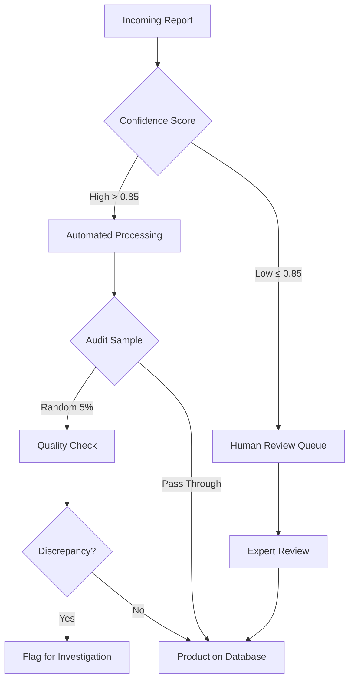

## Introduction

The gap between a Jupyter notebook and a hospital server is not just a matter of deployment engineering—it's a fundamental difference in objectives.

Machine learning researchers are trained to chase the upper bounds of performance metrics. We want the highest F1-score, the lowest perplexity, or the best position on the HuggingFace leaderboard. But at the British Columbia Cancer Registry (BCCR), where our team processes thousands of pathology reports to track cancer incidence and patient outcomes, we learned that a "perfect" model can still fail to solve the actual problem<d-cite key="gondara2023classifying,gondara2024detecting"></d-cite>.

Over four years, we deployed various NLP models—from simple regex patterns to fine-tuned BERT models to large language models—for tasks including tumor reportability classification, cancer relapse detection, and report segmentation. This is the unvarnished reality of what worked, what didn't, and why the gap between research and production is wider than most people think.

## The Metric Trap

In a standard classification task, we define success as maximizing accuracy, F1-score, or Area Under the Curve. But in a production registry pipeline, the cost functions are asymmetric and tied to human labor, not model metrics.

Consider our task of reportable tumor identification—determining which pathology reports contain cancers that must be tracked by the registry. The academic goal is straightforward: maximize F1-score by balancing precision and recall. The reality is messier. Every positive prediction triggers a manual review by a highly trained tumor registrar who earns $40/hour. Every negative prediction is archived. If a model has high recall but moderate precision, it floods registrars with false alarms, creating burnout and backlogs.

We discovered that the metric that actually mattered was **time saved per report**. Let me show you the math from our deployment. In the manual process, we had 1,000 true positives and 400 false positives, totaling 1,400 reviews at 1 minute each—that's 1,400 minutes of work. With our AI-assisted process, better filtering reduced this to 1,000 true positives and just 100 false positives. But here's the kicker: because the AI highlighted relevant text passages, review time dropped to 30 seconds per report. Total time: 1,100 reviews times 0.5 minutes equals 550 minutes. That's a 60% reduction in processing time, despite model accuracy of only 95% compared to a theoretical maximum of 98%.

This revealed something counterintuitive. A model with 95% accuracy that integrates seamlessly into the workflow saves more time than a 98% accurate model that requires registrars to read the entire report anyway. The table below shows three different models we evaluated. Model C won in production despite having what looks like only marginally better metrics on paper:

<table>
  <thead>
    <tr>
      <th>Model</th>
      <th>Precision</th>
      <th>Recall</th>
      <th>F1-Score</th>
      <th>Reviews/Day</th>
      <th>Time Saved</th>
      <th>Deployed?</th>
    </tr>
  </thead>
  <tbody>
    <tr>
      <td>Model A (High Recall)</td>
      <td>0.71</td>
      <td>0.98</td>
      <td>0.82</td>
      <td>1,380</td>
      <td>2%</td>
      <td>❌</td>
    </tr>
    <tr>
      <td>Model B (Balanced)</td>
      <td>0.85</td>
      <td>0.92</td>
      <td>0.88</td>
      <td>1,082</td>
      <td>23%</td>
      <td>❌</td>
    </tr>
    <tr>
      <td><strong>Model C (Hybrid)</strong></td>
      <td><strong>0.93</strong></td>
      <td><strong>0.95</strong></td>
      <td><strong>0.94</strong></td>
      <td><strong>1,100</strong></td>
      <td><strong>61%</strong></td>
      <td><strong>✅</strong></td>
    </tr>
  </tbody>
</table>

Model C succeeded because it didn't just filter cases—it highlighted evidence. When a report was flagged as reportable, the system extracted and highlighted sentences like "invasive ductal carcinoma, grade 2," cutting per-report review time in half. This is the kind of integration that makes or breaks deployment. Don't optimize for metrics in isolation. Optimize for the workflow.

## When Boring Beats SOTA

With all the hype around Generative AI, there's enormous pressure to throw an LLM at every text processing problem. We found this to be computationally wasteful and often less effective than simpler methods.

We ended up building what we call a pragmatic hybrid architecture—a waterfall approach where data flows through progressively more sophisticated models, with simpler methods handling structured patterns and complex models reserved for genuinely ambiguous cases.



    Figure 1: Our hybrid architecture processes reports through three layers of increasing sophistication. Most cases are handled by the first two layers; only 8-12% require the expensive LLM layer.

The first layer uses regular expressions. Yes, regex—the "boring" solution. But for structured data like dates, ICD codes, or tumor staging notation like "pT2N1M0," regex provides 100% precision, zero hallucinations, instant processing, and complete explainability. Extracting "Grade 3" from "Histologic grade: 3/3" requires no machine learning whatsoever.

The second layer uses specialized BERT models<d-cite key="lee2020biobert,alsentzer2019publicly"></d-cite>. For classification tasks requiring semantic understanding, a fine-tuned BioBERT with 110 million parameters classifies reportability with 95% accuracy in 50 milliseconds per document. Compare this to GPT-4, which achieves 96% accuracy but costs 100 times more and takes 2-3 seconds per document. That extra 1% accuracy rarely justifies the cost difference.

The third layer is where we finally use LLMs—but only for genuinely difficult cases. Tasks like determining if a tumor is a recurrence versus a new primary when the report discusses both scenarios. Summarization of complex clinical narratives. Extraction of nuanced entities where context is critical. This represents only 8-12% of our cases.

But here's what really surprised us: preprocessing mattered more than model size. Pathology reports are full of noise—headers, disclaimers, clinical history, specimen descriptions. We ran an experiment comparing two approaches. Approach A fed the entire report, averaging 850 words, to a large BERT model and achieved 89% accuracy. Approach B used a simple sequence tagger to segment the report, extracted just the "Diagnosis" section averaging 120 words, and fed it to a smaller BERT model. Result? 94% accuracy. Smarter preprocessing beat bigger models, while reducing compute costs by 70%.

The lesson here isn't that LLMs are bad. It's that model selection should be pragmatic, not trendy. Match the complexity of the method to the complexity of the problem. Save your expensive models for problems that actually need them.

## The Data Quality Ceiling

In academic datasets like IMDB or SQuAD, the labels are provided. In healthcare, labels must be created, often by the same experts you're trying to automate. We learned this the hard way.

Early in our project, we collected 10,000 pathology reports and had different registrars label them independently. Inter-annotator agreement came in at Cohen's κ = 0.73, which is technically "substantial" but not excellent. When we trained a model on this data, it plateaued at 82% accuracy. We threw more data at it, tried different architectures, tuned hyperparameters for weeks. Nothing budged the needle. The model had hit the ceiling of label quality.

We pivoted our entire approach. Instead of collecting more labels, we held facilitated sessions with five or six senior registrars to discuss every edge case we could find. We created a 40-page code book with precise definitions for each label, 50+ annotated examples covering edge cases, and decision trees for ambiguous scenarios. We implemented dual annotation with adjudication for disagreements. Then we re-labeled a calibration set of 500 reports together, as a group, until everyone understood the standards.

Inter-annotator agreement jumped to κ = 0.91. Our model, trained on this cleaner data with the exact same architecture we'd been using before, immediately hit 95% accuracy. The architecture was never the problem. The labels were the problem.

But data quality isn't just about annotation. It's also about drift. Medical terminology evolves. In 2021, "adenocarcinoma NOS" (not otherwise specified) was common. By 2023, reports increasingly specified molecular subtypes like "luminal B invasive carcinoma." Our model, trained on 2019-2020 data, struggled with this new terminology<d-cite key="finlayson2021clinician"></d-cite>.



    Figure 2: Model performance degrades over time as medical terminology and reporting practices evolve. Without continuous monitoring and retraining, accuracy dropped 13 percentage points over 18 months.

We implemented automated drift detection with monthly monitoring of prediction distributions and confidence scores. We retrain quarterly, incorporating recent examples. We maintain version control and sometimes run an ensemble of models from different time periods when we're between training cycles.

The fundamental insight is this: if humans can't agree on the label, the model has no chance. Invest heavily in annotation infrastructure before investing in model complexity. Data quality beats algorithm sophistication every single time.

## Error Handling as System Design

No model is perfect, and in healthcare, errors have consequences. We learned that how you handle errors matters more than eliminating them entirely.

Our system uses a multi-layer safety net. When a report comes in, we first check the model's confidence score. Anything above 0.85 goes to automated processing. Anything below goes straight to the human review queue—that's about 15% of reports. The automated ones don't just sail through though. We randomly sample 5% for quality checks, and any discrepancies trigger investigation.

    Figure 3: Our error mitigation pipeline isn't an afterthought—it's fundamental system architecture.

But here's the crucial part: not all errors are equal. False negatives—missing a cancer—are catastrophic. They could delay patient treatment, and they carry legal and ethical implications. Our target is under 2% false negative rate. False positives—flagging a non-cancer as reportable—are merely annoying. They waste 30 seconds of registrar time but get caught immediately during review. We can tolerate up to 10% false positive rate.

Our final model configuration reflects this asymmetry: 98.2% recall and 92.1% precision. We intentionally sacrificed precision to ensure near-zero false negatives. This is the opposite of what you'd do if you were optimizing for F1-score, but it's exactly right for the operational reality.

We also implemented continuous auditing inspired by clinical trial design<d-cite key="gondara2024auditing"></d-cite>. Every week, we review a random 5% sample. Every quarter, we retrospectively review all cases that registrars flagged as questionable. And we have triggered audits that automatically kick in when our prediction distribution shifts. This caught several issues early: a new hospital using non-standard report formats in week three, terminology drift for a rare tumor type at month six, and an edge case involving double primary cancers at month nine.

The lesson is simple: accept that errors will happen and design your system to handle them gracefully. Confidence thresholds, human-in-the-loop validation, and continuous monitoring aren't optional safety features. They're essential system architecture for responsible deployment.

## Co-Design or Fail

We had a significant advantage: we are the provincial cancer registry. Our team includes both ML researchers and tumor registrars, with direct access to oncologists for decisions requiring deeper clinical expertise. This internal collaboration was the best investment we made.

We started by deeply understanding our registrars' workflows. We sat with them, timing each step and identifying pain points. The biggest issue? Reading 850-word reports to find the two sentences that actually mattered. We ran structured discussions about what actually helps. What takes the most time? Where do errors happen? What would make their job easier? The answers were illuminating: "Show me the evidence, don't just give me a yes/no." "False positives are okay, false negatives never are." "I need to understand why the system flagged something."



    Figure 4: Successful deployment required alignment across multiple groups within the registry—ML researchers, registrars, IT infrastructure, privacy officers, and consulting oncologists—each with different priorities and expertise.

In our co-design sessions with registrars and consulting oncologists, we sketched UI mockups together, defined success metrics collaboratively, and agreed on pilot scope and timeline. During one of these sessions, we almost made a critical error. Our initial goal was: "Build a model with 99% accuracy for tumor reportability." A senior registrar stopped us cold. "That's not what we need," she said. "We need to reduce the 24-month backlog. Can your model help with that?"

This reframing changed everything. We pivoted to: "Reduce the backlog by 50% within 12 months while maintaining quality." This led us to prioritize completely different features. Evidence highlighting saved time per report. Batch processing handled the backlog efficiently. Confidence scoring triaged urgent cases. Without this internal collaboration between ML researchers, registrars, and clinical experts, we would have built a technically impressive model that solved the wrong problem.

Having cancer registry staff as part of our team, with direct access to oncologists for clinical decisions, gave us an enormous advantage. But it didn't make co-design automatic. We still had to actively bridge the gap between ML researchers who think in terms of precision and recall, registrars who think in terms of workflow efficiency, and oncologists who think in terms of diagnostic accuracy and patient care. The key insight: your technical team needs to translate operational needs into technical specifications, not impose technical solutions onto existing workflows.

## Build vs Buy

Many healthcare organizations lack in-house ML expertise and opt to buy off-the-shelf AI tools. This is risky. We watched multiple organizations get burned. One hospital purchased a $500K "AI pathology assistant" that achieved 67% accuracy on their actual reports versus the 95% advertised. The vendor had trained on urban academic medical center reports. The hospital had rural community reports with completely different formatting.

We developed what we call the DARE framework for evaluating external tools. **D** stands for Demand Robust Validation. Don't accept vendor whitepapers or cherry-picked examples. Require validation on your data distribution, minimum 1,000 real examples. Insist on stratified performance metrics by report type, hospital, and time period. Get performance guarantees in writing.

**A** is Assess Flexibility. Can the tool handle your specific quirks? Can it process reports with non-standard headers? Can you fine-tune it on your data, or is it a black box? What happens when your data distribution inevitably changes?

**R** means Rigorously Test Internal Compatibility. Does the tool introduce fairness biases for your patient demographics? Can it integrate with your existing IT infrastructure without requiring a complete rebuild? Does it comply with your privacy regulations? What's the total cost of ownership including licensing, integration, and ongoing maintenance?

**E** is Ease of Evaluation. Is the tool a black box or does it provide transparent logs for auditing? Can you inspect individual predictions to understand failure modes? Does it provide confidence scores or just hard predictions? Can clinical staff override the AI when their judgment differs?

We use a simple decision matrix. For standard tasks where commercial tools are available and you're processing small volumes, buy something and validate it with DARE. For unique workflows with unusual data formats and high volumes, build custom. For rapidly evolving requirements where you need to experiment, build. For strict regulatory constraints requiring complete transparency, build. For commodity tasks with proven solutions and budget constraints, buy and leverage vendor expertise.

At BCCR, we built our core classification models because of our unique requirements, but we use commercial OCR and document parsing tools where standardization exists. The key is maintaining healthy skepticism. Always validate on your own data before committing.

## What We Actually Achieved

After four years of iteration, here's what changed:

  <table>
    <thead>
      <tr>
        <th>Metric</th>
        <th>Before</th>
        <th>After</th>
        <th>Change</th>
      </tr>
    </thead>
    <tbody>
      <tr>
        <td>Processing time per report</td>
        <td>60 seconds</td>
        <td>30 seconds</td>
        <td>50% reduction</td>
      </tr>
      <tr>
        <td>Backlog size</td>
        <td>24 months</td>
        <td>6 months</td>
        <td>75% reduction</td>
      </tr>
      <tr>
        <td>Inter-coder agreement</td>
        <td>κ = 0.87</td>
        <td>κ = 0.93</td>
        <td>More consistent</td>
      </tr>
      <tr>
        <td>Time on complex cases</td>
        <td>30% of day</td>
        <td>60% of day</td>
        <td>2x expert time</td>
      </tr>
      <tr>
        <td>False negative rate</td>
        <td>3.2%</td>
        <td>1.8%</td>
        <td>44% fewer missed cancers</td>
      </tr>
    </tbody>
  </table>

The most important metric wasn't on any leaderboard. By automating routine decisions, we freed registrars to spend 60% of their day—versus 30% before—on complex cases requiring human judgment. Cases with ambiguous tumor margins. Unusual histologies requiring research. Multi-tumor scenarios demanding careful reasoning. One registrar told us: "Before, I felt like a data entry clerk. Now I feel like a cancer detective again."

Our subsequent projects benefited from these lessons. Relapse detection from CT reports<d-cite key="gondara2024detecting"></d-cite>, report segmentation, biomarker extraction—all deployed 40-50% faster because we knew what mattered.

## Conclusion

The journey from academic ML to deployed healthcare AI requires rethinking everything we learned in grad school. Stop optimizing for metrics; start optimizing for workflows. A 95% accurate model that saves 60% of processing time beats a 98% accurate model that saves 10%. Stop chasing trends; start matching tools to problems. Regex can outperform GPT-4 on structured extraction. BioBERT can beat Llama-3 on domain classification while costing 100 times less. Stop treating deployment as an afterthought; start with close collaboration between technical and operational teams. Understanding the actual workflow prevented us from building the wrong thing.

The gap between research and production is wide, but it's bridgeable. It requires humility, pragmatism, and a willingness to prioritize patient outcomes over publication metrics. In machine learning conferences, SOTA means topping the leaderboard. In healthcare, true SOTA is different. It's a system that runs reliably, respects patient privacy, and actually reduces the backlog so patients can get care faster.

**The real SOTA is AI that works.**
