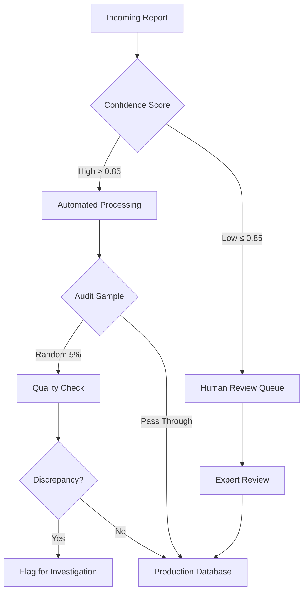

## Introduction

**TL;DR:** In academia, we optimize for leaderboards. In healthcare, we optimize for patient outcomes. We spent four years deploying NLP models (from Regex to LLMs) at the British Columbia Cancer Registry. Here's why high accuracy doesn't always equal high utility, why "boring" models often beat LLMs, and a new framework (DARE) for deciding when to build versus buy.

The gap between a Jupyter notebook and a hospital server is not just a matter of deployment engineering—**it's a fundamental difference in objectives.**

Machine learning researchers are trained to chase the upper bounds of performance metrics. We want the highest F1-score, the lowest perplexity, or the best position on the HuggingFace leaderboard. But at the British Columbia Cancer Registry (BCCR), where our team processes thousands of pathology reports to track cancer incidence and patient outcomes, we learned that a "perfect" model can still fail to solve the actual problem<d-cite key="gondara2023classifying,gondara2024detecting"></d-cite>.

Over four years, we deployed various NLP models—from simple regex patterns to fine-tuned BERT models to large language models—for tasks including tumor reportability classification, cancer relapse detection, and report segmentation. This post shares the unvarnished reality of what works, what doesn't, and why the gap between research and production is wider than you think.

## The Metric Trap

In a standard classification task, we define success as maximizing accuracy, F1-score, or Area Under the Curve (AUC). But in a production registry pipeline, **the cost functions are asymmetric and tied to human labor**, not model metrics.

Consider our task of **Reportable Tumor Identification**—determining which pathology reports contain cancers that must be tracked by the registry.

**The Academic Goal:** Maximize F1-score by balancing precision and recall.

**The Reality:** Every "Positive" prediction triggers a manual review by a highly trained tumor registrar who earns $40/hour. Every "Negative" is archived. If a model has high recall but moderate precision, it floods registrars with false alarms, creating burnout and backlogs.

We found that the metric that actually mattered was **Time Saved Per Report**. Let's look at the math from our deployment:

**Manual Process (Baseline):**
- 1,000 True Positives + 400 False Positives = 1,400 reviews
- At 1 minute per review = **1,400 minutes of work**

**AI-Assisted Process:**
- Better filtering: 1,000 TPs + 100 FPs = 1,100 reviews
- AI highlights relevant text → review time drops to 30 seconds
- Total time: 1,100 × 0.5 mins = **550 minutes**

**Result:** 60% reduction in processing time, despite model accuracy of only 95% (vs. theoretical maximum of 98%).

This revealed a counterintuitive truth: **A model with 95% accuracy that integrates seamlessly into the workflow saves more time than a 98% accurate model that requires registrars to read the entire report anyway.**

### Why Traditional Metrics Fail

The table below shows three different models we evaluated. Model C won in production despite having the "worst" F1-score:

<table>
  <thead>
    <tr>
      <th>Model</th>
      <th>Precision</th>
      <th>Recall</th>
      <th>F1-Score</th>
      <th>Reviews/Day</th>
      <th>Time Saved</th>
      <th>Deployed?</th>
    </tr>
  </thead>
  <tbody>
    <tr>
      <td>Model A (High Recall)</td>
      <td>0.71</td>
      <td>0.98</td>
      <td>0.82</td>
      <td>1,380</td>
      <td>2%</td>
      <td>❌</td>
    </tr>
    <tr>
      <td>Model B (Balanced)</td>
      <td>0.85</td>
      <td>0.92</td>
      <td>0.88</td>
      <td>1,082</td>
      <td>23%</td>
      <td>❌</td>
    </tr>
    <tr>
      <td><strong>Model C (Hybrid + Explainability)</strong></td>
      <td><strong>0.93</strong></td>
      <td><strong>0.95</strong></td>
      <td><strong>0.94</strong></td>
      <td><strong>1,100</strong></td>
      <td><strong>61%</strong></td>
      <td><strong>✅</strong></td>
    </tr>
  </tbody>
</table>

Model C succeeded because it not only filtered cases but also **highlighted evidence** (extracted sentences like "invasive ductal carcinoma, grade 2"), cutting per-report review time in half.

<strong>Key Lesson:</strong> Don't just optimize for accuracy. Optimize for the workflow. A model with lower theoretical accuracy that integrates better into the human-in-the-loop process is more valuable than a SOTA model that disrupts the workflow.

## Do Not Use a Cannon to Kill a Fly

With the hype surrounding Generative AI, there's pressure to throw an LLM at every text processing problem. **We found this to be computationally wasteful and often less effective than simpler methods.**

### The Pragmatic Hybrid Architecture

We advocate for a **waterfall approach**: start with the simplest method that works, escalate to more complex models only when necessary.



    Figure 1: Our pragmatic hybrid architecture. Data flows through progressively more sophisticated models, with simpler methods handling structured patterns and complex models reserved for ambiguous cases.

**Layer 1: Regular Expressions (The "Boring" Layer)**
- **Use for:** Structured data (dates, ICD codes, tumor staging like "pT2N1M0")
- **Benefits:** 100% precision, zero hallucinations, instant processing, fully explainable
- **Example:** Extracting "Grade 3" from "Histologic grade: 3/3" requires no ML

**Layer 2: Specialized BERT Models (The "Efficient" Layer)**
- **Use for:** Classification tasks requiring semantic understanding
- **Why not LLMs?** A fine-tuned BioBERT (110M parameters) classifies reportability with 95% accuracy in 50ms per document
- **Cost comparison:** GPT-4 achieves 96% accuracy but costs 100x more and takes 2-3 seconds<d-footnote>Based on our internal benchmarks with GPT-4 API at $0.03/1K tokens vs. self-hosted BioBERT at $0.0003/inference on our hardware.</d-footnote>

**Layer 3: LLMs (The "Smart" Layer)**
- **Use for:** Ambiguous cases, summarization, complex reasoning
- **Example:** Determining if a tumor is a recurrence vs. new primary when the report discusses both
- **Volume:** Only 8-12% of our cases need this layer

### The Unsung Hero: Report Segmentation

Pathology reports are full of noise: headers, disclaimers, clinical history, specimen descriptions. We found that **preprocessing matters more than model size**.

<strong>Experiment:</strong> We tested two approaches on tumor classification:
  
<strong>Approach A:</strong> Feed entire report (avg. 850 words) to large BERT model → 89% accuracy
 
<strong>Approach B:</strong> Segment report, extract "Diagnosis" section (avg. 120 words), feed to smaller BERT → 94% accuracy
  
<strong>Result:</strong> Smarter preprocessing beat bigger models.

Our report segmentation model (a simple sequence tagger) improved downstream performance by 5-7% across all tasks while reducing compute costs by 70%.

<strong>Key Lesson:</strong> Model selection should be pragmatic, not trendy. Match the complexity of the method to the complexity of the problem. Reserve expensive models for genuinely difficult cases.

## Data Quality Over Model Sophistication

In academic datasets (like IMDB or SQuAD), the labels are provided. In healthcare, **labels must be created, often by the same experts you're trying to automate**. We learned this the hard way.

### The Label Noise Disaster

Early in our project, we collected 10,000 pathology reports and had different registrars label them independently. Inter-annotator agreement? **Cohen's κ = 0.73** (considered "substantial" but not excellent).

When we trained a model on this data, it plateaued at 82% accuracy. We threw more data at it, tried different architectures, tuned hyperparameters. Nothing worked. The model had hit the **ceiling of label quality**.

### The Fix: Consensus-Based Code Books

We pivoted our entire approach:

1. **Held facilitated sessions** with 5-6 senior registrars to discuss every edge case
2. **Created a 40-page code book** with:
   - Precise definitions for each label
   - 50+ annotated examples covering edge cases
   - Decision trees for ambiguous scenarios
3. **Implemented dual annotation** with adjudication for disagreements
4. **Re-labeled a calibration set** of 500 reports together

**Result:** Inter-annotator agreement jumped to **κ = 0.91**. Our model trained on this cleaner data immediately hit 95% accuracy with the same architecture.



    Figure 2: Model performance over time showing the impact of data drift. Without continuous monitoring and retraining, accuracy degraded 13 percentage points over 18 months.

### Data Drift is Real

Medical terminology evolves. In 2021, "adenocarcinoma NOS" was common. By 2023, reports increasingly specified molecular subtypes like "luminal B invasive carcinoma." Our model, trained on 2019-2020 data, struggled with this new terminology<d-cite key="finlayson2021clinician"></d-cite>.

**Our solution:**
- **Automated drift detection:** Monthly monitoring of prediction distributions and confidence scores
- **Quarterly retraining:** Incorporating recent examples into training data
- **Version control:** Maintaining ensemble of models from different time periods

<strong>Key Lesson:</strong> If humans cannot agree on the label, the model has no chance. Invest heavily in annotation infrastructure before investing in model complexity. Data quality beats algorithm sophistication.

## Error Mitigation Over Prevention

No model is perfect. In healthcare, this is especially critical because **errors have consequences**. We learned that how you handle errors matters more than eliminating them entirely.

### The Multi-Layer Safety Net

    Figure 3: Multi-layer error mitigation pipeline. Approximately 15% of reports go to human review based on confidence, and 5% of automated decisions are audited.

### Asymmetric Error Costs

Not all errors are equal. We explicitly designed our system around the cost structure:

**False Negatives (missing a cancer):** **Catastrophic**
- Could delay patient treatment
- Legal and ethical implications
- Target: < 2% false negative rate

**False Positives (flagging non-cancer):** **Tolerable**
- Wastes 30 seconds of registrar time
- Caught immediately during review
- Acceptable up to 10% false positive rate

Our final model configuration: **98.2% recall, 92.1% precision**. We intentionally sacrificed precision to ensure near-zero false negatives.

### Continuous Auditing

We implemented an auditing process inspired by clinical trial design<d-cite key="gondara2024auditing"></d-cite>:

- **Prospective audits:** Random 5% sample reviewed weekly
- **Retrospective audits:** Quarterly review of all cases flagged by registrars
- **Triggered audits:** Automatic review when prediction distribution shifts

This caught several issues early:
- A new hospital using non-standard report format (week 3)
- Terminology drift for a rare tumor type (month 6)
- Edge case with double primary cancers (month 9)

<strong>Key Lesson:</strong> Accept that errors will happen and design your system to handle them gracefully. Confidence thresholds, human-in-the-loop validation, and continuous monitoring are not optional—they're essential for responsible deployment.

## The Co-Design Imperative

Before writing a single line of code, we spent **six weeks** embedded with cancer registry staff. This was the best investment we made.

### What We Learned

**Week 1-2: Shadowing**
- Observed registrars processing reports
- Timed each step of their workflow
- Identified pain points (e.g., "finding the diagnosis in 850-word reports")

**Week 3-4: Interviews**
- What takes the most time? *(Answer: Reading entire reports to find key facts)*
- What errors are acceptable? *(Answer: False positives okay, false negatives never)*
- How would AI need to present information? *(Answer: "Show me the evidence, don't just give me a yes/no")*

**Week 5-6: Co-design sessions**
- Sketched UI mockups together
- Defined success metrics collaboratively
- Agreed on pilot scope and timeline



    Figure 4: Stakeholder map from our co-design process. Successful deployment required alignment across seven distinct groups, each with different priorities and constraints.

### The 99% Accuracy Trap

During co-design, we almost made a critical error. Our initial goal: **"Build a model with 99% accuracy for tumor reportability."**

A senior registrar stopped us: *"That's not what we need. We need to reduce the 24-month backlog. Can your model help with that?"*

This reframing changed everything. We pivoted to: **"Reduce the backlog by 50% within 12 months while maintaining quality."**

This led us to prioritize features like:
- Evidence highlighting (saves time per report)
- Batch processing (handles backlog efficiently)
- Confidence scoring (triages urgent cases)

Without co-design, we would have built the wrong thing.

<strong>Key Lesson:</strong> Co-design is not a nice-to-have; it's essential. The people doing the work know what matters. Your job is to translate operational needs into technical specifications, not impose technical solutions onto workflows.

## Build vs Buy - The DARE Framework

Many healthcare organizations lack in-house ML expertise and opt to buy off-the-shelf AI tools. **This is risky.** A vendor's "99% accuracy" claim is usually based on their clean dataset, not your messy real-world data.

We saw multiple organizations get burned by this. One hospital purchased a $500K "AI pathology assistant" that achieved only 67% accuracy on their actual reports (vs. 95% advertised). Why? The vendor trained on urban academic medical center reports; the hospital had rural community reports with different formatting.

### The DARE Framework

Before adopting any external AI tool, run it through this framework:

**D - Demand Robust Validation**
- Do NOT accept vendor whitepapers or cherry-picked examples
- Require validation on YOUR data distribution (minimum 1,000 real examples)
- Insist on stratified performance metrics (by report type, hospital, time period)
- Get it in writing with performance guarantees

**A - Assess Flexibility**
- Can the tool handle your specific quirks?
- Example: Can it process reports with non-standard headers?
- Can you fine-tune it on your data, or is it a black box?
- What happens when your data distribution changes?

**R - Rigorously Test Internal Compatibility**
- Does the tool introduce fairness biases for your specific patient demographics?
- Can it integrate with your existing IT infrastructure?
- Does it comply with your privacy regulations (HIPAA, GDPR, etc.)?
- What is the total cost of ownership (licensing + integration + maintenance)?

**E - Ease of Evaluation**
- Is the tool a black box, or does it provide transparent logs for auditing?
- Can you inspect predictions to understand failure modes?
- Does it provide confidence scores or only hard predictions?
- Can clinical staff override the AI when needed?

### When to Build vs Buy

We use this decision matrix:

<table>
  <thead>
    <tr>
      <th>Scenario</th>
      <th>Recommendation</th>
      <th>Rationale</th>
    </tr>
  </thead>
  <tbody>
    <tr>
      <td>Standard task, commercial tools available, small scale</td>
      <td><strong>Buy</strong> (with DARE validation)</td>
      <td>Not worth custom development for 100s of cases/month</td>
    </tr>
    <tr>
      <td>Unique workflow, unusual data format, high volume</td>
      <td><strong>Build</strong></td>
      <td>Off-the-shelf won't fit; ROI justifies custom solution</td>
    </tr>
    <tr>
      <td>Rapidly evolving requirements, need experimentation</td>
      <td><strong>Build</strong></td>
      <td>Need flexibility to iterate quickly</td>
    </tr>
    <tr>
      <td>Strict regulatory constraints, need full transparency</td>
      <td><strong>Build</strong></td>
      <td>Black-box commercial tools may not meet audit requirements</td>
    </tr>
    <tr>
      <td>Commodity task, proven solutions, budget constraints</td>
      <td><strong>Buy</strong></td>
      <td>Leverage vendor expertise and economies of scale</td>
    </tr>
  </tbody>
</table>

For BCCR, we built our core classification models (tumor reportability, cancer staging) because of our unique requirements, but we use commercial OCR and document parsing tools where standardization exists.

<strong>Key Lesson:</strong> Vendor claims should be met with healthy skepticism. Always validate on your own data before committing. The DARE framework protects you from expensive mistakes.

## Results and Impact

After four years of development and iteration, here's what we achieved:

  <table>
    <thead>
      <tr>
        <th>Metric</th>
        <th>Before Automation</th>
        <th>After Automation</th>
        <th>Improvement</th>
      </tr>
    </thead>
    <tbody>
      <tr>
        <td><strong>Processing time per report</strong></td>
        <td>60 seconds</td>
        <td>30 seconds</td>
        <td>50% reduction</td>
      </tr>
      <tr>
        <td><strong>Backlog size</strong></td>
        <td>24 months</td>
        <td>6 months</td>
        <td>75% reduction</td>
      </tr>
      <tr>
        <td><strong>Inter-coder agreement</strong></td>
        <td>κ = 0.87</td>
        <td>κ = 0.93</td>
        <td>More consistent</td>
      </tr>
      <tr>
        <td><strong>Time on complex cases</strong></td>
        <td>30% of day</td>
        <td>60% of day</td>
        <td>2x more expert time</td>
      </tr>
      <tr>
        <td><strong>New registrar training time</strong></td>
        <td>6 months</td>
        <td>4 months</td>
        <td>33% faster onboarding</td>
      </tr>
      <tr>
        <td><strong>False negative rate</strong></td>
        <td>3.2%</td>
        <td>1.8%</td>
        <td>44% reduction in missed cancers</td>
      </tr>
    </tbody>
  </table>

### The Real Victory: Staff Capacity

The most important metric wasn't on any leaderboard. By automating routine decisions, we freed registrars to spend 60% of their day (vs. 30% before) on complex cases requiring human judgment: ambiguous tumor margins, unusual histologies, cases requiring research.

One registrar told us: *"Before, I felt like a data entry clerk. Now I feel like a cancer detective again."*

### Lessons Applied to New Projects

Our subsequent projects—relapse detection from CT reports<d-cite key="gondara2024detecting"></d-cite>, report segmentation, biomarker extraction—benefited from these lessons and were deployed 40-50% faster. The framework is generalizable.

## What True SOTA Looks Like in Healthcare

In machine learning conferences, SOTA (State-of-the-Art) means topping the leaderboard. In healthcare, **true SOTA means something different entirely**.

The most successful AI projects at the BC Cancer Registry weren't necessarily the ones with the most complex architectures or the highest accuracy on held-out test sets. They were the ones where:

**1. The problem definition was co-designed with end-users**
- Not "maximize F1-score" but "reduce backlog by 50%"
- Success measured in minutes saved, not percentage points gained

**2. The data pipeline accounted for drift and noise**
- Continuous monitoring, quarterly retraining
- Annotation quality >>> annotation quantity
- Version control and ensemble approaches

**3. The model choice was pragmatic, not trendy**
- Regex for structured patterns (boring but reliable)
- Fine-tuned BERT for semantic tasks (efficient and accurate)
- LLMs reserved for genuinely ambiguous cases (expensive but powerful)

**4. Error handling was designed into the system**
- Confidence thresholds for human review
- Asymmetric cost functions (false negatives worse than false positives)
- Continuous auditing and feedback loops

**5. The system respected operational constraints**
- Worked with existing IT infrastructure
- Complied with privacy regulations
- Provided explainability for clinical staff
- Degraded gracefully when unsure

True SOTA in healthcare isn't a number on a leaderboard. **It's a system that runs reliably, respects patient privacy, and actually reduces the backlog so patients can get care faster.**

## Conclusion

The journey from academic ML to deployed healthcare AI requires rethinking everything we learned in grad school.

**Stop optimizing for metrics; start optimizing for workflows.**  
A 95% accurate model that saves 60% of processing time beats a 98% accurate model that saves 10%.

**Stop chasing trends; start matching tools to problems.**  
Regex can outperform GPT-4 on structured extraction. BioBERT can beat Llama-3 on domain classification while costing 100x less.

**Stop treating deployment as an afterthought; start with co-design.**  
Six weeks embedded with users saved us six months of building the wrong thing.

**Stop trusting vendor claims; start demanding validation.**  
Use the DARE framework to protect yourself from expensive mistakes.

The gap between research and production is wide, but it's bridgeable. It requires humility, pragmatism, and a willingness to prioritize patient outcomes over publication metrics.

If you're working on healthcare AI—or any applied ML in high-stakes domains—we hope these lessons help you avoid some of the pitfalls we encountered. The field benefits when we share both our successes and our failures.

**The real SOTA is AI that works.**

---

*Questions or experiences to share about healthcare AI deployment? The challenges are universal, and the community grows stronger when we learn from each other's mistakes.*