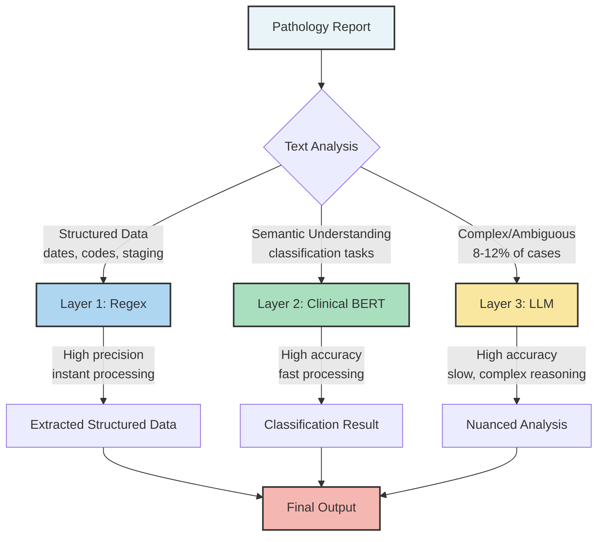
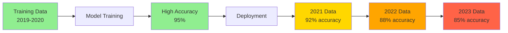
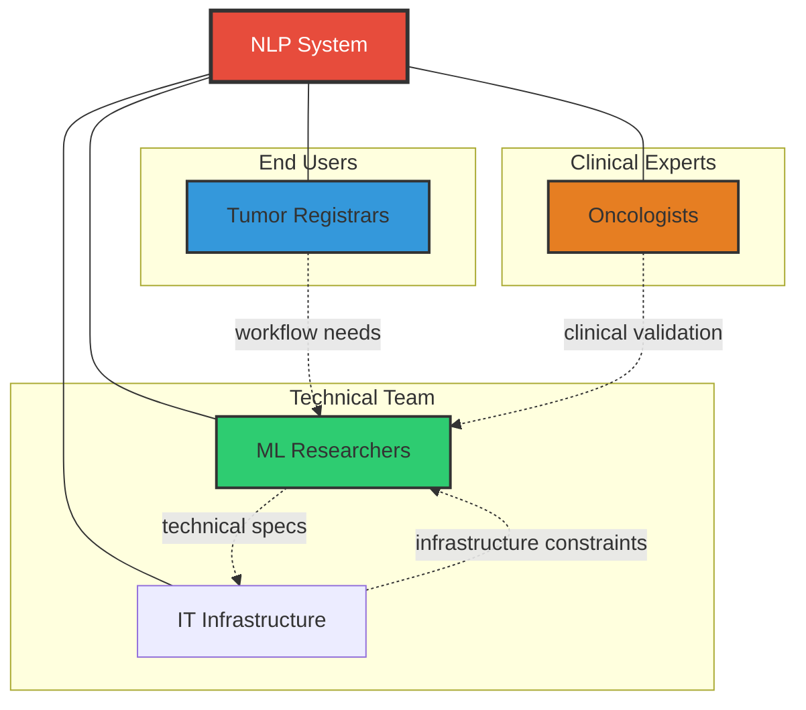

## Introduction

The gap between a Jupyter notebook and a hospital server is not just a matter of deployment engineering, it is a fundamental conflict of objectives.

Machine learning researchers are trained to chase the upper bounds of performance metrics. We want the highest F1-score, the lowest perplexity, or the top spot on a leaderboard. But at the **British Columbia Cancer Registry (BCCR)**, where our team processes millions of pathology reports to track cancer incidence and patient outcomes, we learned that a "perfect" model can still fail to solve the actual problem.

Over four years, we deployed various NLP models, from simple regex patterns to fine-tuned BERT models and Large Language Models (LLMs), for tasks including tumor reportability classification, cancer relapse detection, anatomical site identification, and report segmentation.

This post shares the unvarnished reality of what worked, what didn't, and why the gap between research innovation and real-world healthcare deployment is wider than most people think.

## The Metric Trap

In a standard machine learning task, we define success as maximizing some metric, such as accuracy, F1-score, or Area Under the Curve (AUC). But in BCCR’s production registry pipeline, the cost functions are asymmetric and tied to human labor, not model statistics.

Consider our task of **Reportable Tumor Identification**: determining which pathology reports contain cancers that must be tracked by the registry.

**The Academic Goal:** Maximize F1-score by balancing precision and recall.

**The Operational Reality:**
*   Every **Positive** prediction triggers a manual review by a highly trained tumor registrar to finalize the cancer case.
*   Every **Negative** prediction is archived.
*   **False Negatives** are dangerous (missed cancer cases).
*   **False Positives** create burnout (flooding registrars with irrelevant reports).

We discovered that the metric that actually mattered was **Time Saved Per Report**.

Let us do the math from our deployment. Assume a batch of **1,400 reports** (1,000 true positives, 400 negatives). Processing a report manually takes roughly **1 minute**.

1.  **Without AI:** Registrars review all 1,400 reports.
    *   *Total Time:* **1,400 minutes**.
2.  **With Our Model:** The model filters negatives with high precision, leaving 1,100 reports. Crucially, the model also performs **sentence-level highlighting**, pointing to the specific text explaining the decision.
    *   *Review Time:* Reduced to **30 seconds** per report due to highlighting.
    *   *Total Time:* **550 minutes**.

This revealed something counterintuitive: A model with lower theoretical accuracy that integrates better into the human-in-the-loop process (via highlighting) is more valuable than a SOTA model that acts as a black box.

> **The Lesson:** Don't just optimize for accuracy; optimize for the bottleneck. While ML experts measure success by ROC curves, organizations measure success by backlog reduction. A tool that aids interpretability often yields higher utility than a "black box" with marginally higher accuracy.

## Do Not Use a Cannon to Kill a Fly

With all the hype surrounding Generative AI, there is enormous pressure to throw an LLM at every text processing problem. We found this to be computationally wasteful, prone to hallucinations, and often less effective than simpler methods.

We advocate for a **Pragmatic Hybrid Architecture**—a waterfall approach where data flows through progressively more sophisticated models.

    Figure 1: Our pragmatic hybrid architecture processes reports through layers of increasing sophistication, reserving expensive models for genuinely difficult cases.

### Layer 1: The "Boring" Layer (Regex)
For structured data like dates, histology codes, or tumor staging notation (e.g., "T1N0M0"), regular expressions provide **100% precision and zero hallucinations**. They are fast, cheap, and explainable. Extracting "Grade 3" from "Histologic grade: 3/3" does not require a GPU, and it certainly doesn't require an API call to a cloud model.

### Layer 2: The "Efficient" Layer (Specialized BERT)
For classification tasks requiring semantic understanding, a fine-tuned clinical BERT model (like Gatortron or BioClinicalBERT) is vastly more efficient than prompting large LLMs. Smaller, domain-specific models often outperform general-purpose LLMs on focused tasks while costing a fraction of the computational budget.

### Layer 3: The "Smart" Layer (LLMs)
We reserve Generative AI for the **8-12% of cases** that are ambiguous, require complex reasoning, or involve summarization. This represents a small fraction of our volume but handles scenarios where simpler methods fail.

### The Unsung Hero: Report Segmentation
Pathology reports are full of noise: headers, disclaimers, clinical history, and gross descriptions. We found that using a lightweight model to **segment the report**—feeding only the relevant sections (e.g., Diagnosis) to downstream models—improved performance more than simply scaling up model size.

> **The Lesson:** Model selection should be pragmatic, not trendy. Match the complexity of the method to the complexity of the problem. If a regex works, use it. Preprocessing (segmentation) often delivers higher ROI than increasing parameter count.

## Data Quality is Everything

In academic datasets, labels are provided ground truth. In healthcare, labels are opinions that must be curated. We found that label noise was a massive bottleneck. A model trained on a single annotator's data often learned that annotator's biases rather than the medical truth.

### The Fix: Consensus-Based Code Books
We moved away from single-annotator workflows to a consensus-based approach. We spent weeks strictly defining annotation guidelines (a "Code Book") before training a single model.
1.  **Pilot:** Multiple experts label the same set of reports.
2.  **Conflict Resolution:** Disagreements are discussed to refine the Code Book definitions (e.g., "How do we handle 'suspicious for' vs 'consistent with'?").
3.  **Result:** High inter-annotator agreement.

If human experts cannot agree on the label, the model has no chance.

### Data Drift is Real
Medical terminology and reporting formats evolve. A model trained on 2019 pathology reports can struggle with 2024 reports that use newer WHO classifications or different hospital templates.

    Figure 2: Without continuous monitoring, model performance degrades over time as medical terminology shifts.

Our solution involves **Automated Drift Detection**: monitoring prediction distributions and confidence scores. When the model becomes less confident on average, or when the distribution of predicted classes shifts significantly, it is a signal to retrain.

> **The Lesson:** Data quality and representativeness matter more than model sophistication. Invest in a "Code Book" and consensus processes early. Expect your data to drift, and build monitoring systems that alert you when it does.

## Error Handling and System Design

No model is perfect. In healthcare, this is especially critical because errors have real consequences. We learned that **how you handle errors** matters more than eliminating them entirely.

### Confidence-Based Routing
We implemented a multi-layer routing system to mitigate risk:
1.  **High Confidence:** Processed automatically (with random audits).
2.  **Low Confidence:** Flagged for human review.
3.  **Out-of-Distribution:** If a report looks drastically different from training data (e.g., a new document format), it defaults to the manual queue.

### The Audit Loop
We adopted a **clinical-trial design approach** to auditing. Rather than just checking random samples ad-hoc, we established a rigorous sampling protocol to estimate error rates with statistical significance. Every six months, we conduct a structured audit to ensure the model hasn't silently degraded.

> **The Lesson:** Accept that errors will happen and design your system to handle them gracefully. Confidence thresholds, human-in-the-loop validation, and statistically rigorous auditing are essential for reliable healthcare AI systems.

## Privacy is a Non-Negotiable Constraint

When working with sensitive patient data, privacy isn't just a compliance box to check; it is a fundamental architectural constraint.

### The Risk of Memorization
Large Language Models have a known propensity to memorize training data. In a cancer registry, if an adversary can query the model to reconstruct parts of a pathology report (a "Membership Inference Attack"), that is a catastrophic failure.

### Mitigation Strategies
1.  **Local Hosting:** We rely on local, open-weights models (like Llama or Mistral) hosted within our firewall. Sending patient data to a public API is often a non-starter for regulatory reasons.
2.  **Differential Privacy (DP):** We integrated DP into our training pipeline. While DP adds noise that can slightly degrade utility, it provides a mathematical guarantee against data leakage.
3.  **Anonymization:** Pre-processing text to remove PHI (Personal Health Information) before it touches the model adds a layer of defense-in-depth.

> **The Lesson:** Privacy must be integrated into the development lifecycle, not added at the end. Prefer local, offline models for sensitive data, and evaluate the trade-off between Differential Privacy guarantees and model utility.

## Co-Design and AI Literacy

We had a significant advantage: we are the provincial cancer registry. Our team includes ML researchers, tumor registrars, and oncologists.

During our co-design sessions, we realized our initial goal was wrong.
*   **Initial Goal:** "Create an NLP solution that is 99% accurate."
*   **Revised Goal:** "Reduce the 24-month backlog."

This pivot changed everything. Instead of a black-box classifier, we built an **assistive tool** that highlights evidence to speed up human decision-making.

### Building AI Literacy
You cannot simply drop an AI tool on clinical staff and walk away. We invested time in **AI Literacy**: teaching our registrars how the models work, where they fail, and why they make certain predictions. When the domain experts understand the "black box," they trust it more and become better at catching its errors.

    Figure 3: Successful deployment required alignment across multiple groups. Without registrar input, we would have solved the wrong problem.

> **The Lesson:** Involve end-users from Day 1. Co-designing the solution ensures you are solving the business problem (backlogs), not just a technical problem. Furthermore, educating your users about AI capabilities and limitations builds the trust required for adoption.

## Build vs Buy - The DARE Framework

Many healthcare organizations lack in-house ML expertise and opt to buy off-the-shelf AI tools. This is risky. A vendor's "99% accuracy" claim is usually based on their clean dataset, not your messy real-world data.

We propose the **DARE framework** for evaluating external tools:

| D | **Demand Robust Validation** | Do not accept whitepapers. Demand validation on *your* local data distribution. Vendors should provide stratified performance metrics on your actual data. |
| A | **Assess Flexibility** | Can the tool handle your specific quirks (e.g., local report formatting)? Can you fine-tune it when your data distribution changes? |
| R | **Rigorous Internal Compatibility** | Does the tool introduce fairness biases regarding your specific demographics? Does it integrate with your IT infrastructure? Does it comply with your privacy regulations? |
| E | **Ease of Evaluation** | Is the tool a black box? Can you inspect predictions to understand failure modes? Does it provide confidence scores? Can clinical staff override the AI when needed? |

> **The Lesson:** Be skeptical of "plug-and-play" AI. Use the DARE framework to validate vendor claims on *your* specific data before committing resources.

## Conclusion

The journey from academic ML to deployed healthcare AI requires rethinking everything we learned in grad school.

1.  **Stop optimizing for metrics; start optimizing for workflows.** The solution that saves the most time isn't always the one with the highest accuracy on a held-out test set.
2.  **Stop chasing trends; start matching tools to problems.** Regex can outperform LLMs on structured extraction. Reserve expensive models for problems that actually need them.
3.  **Stop treating deployment as an afterthought.** Internal collaboration between ML researchers and registrars prevented us from building technically impressive solutions that solved the wrong problems.
4.  **Stop trusting vendor claims; start demanding validation.** Use the DARE framework to protect yourself.

The gap between research and production is wide, but it's bridgeable. It requires humility, pragmatism, and a willingness to prioritize patient outcomes over publication metrics.

**The real SOTA is AI that works.**
