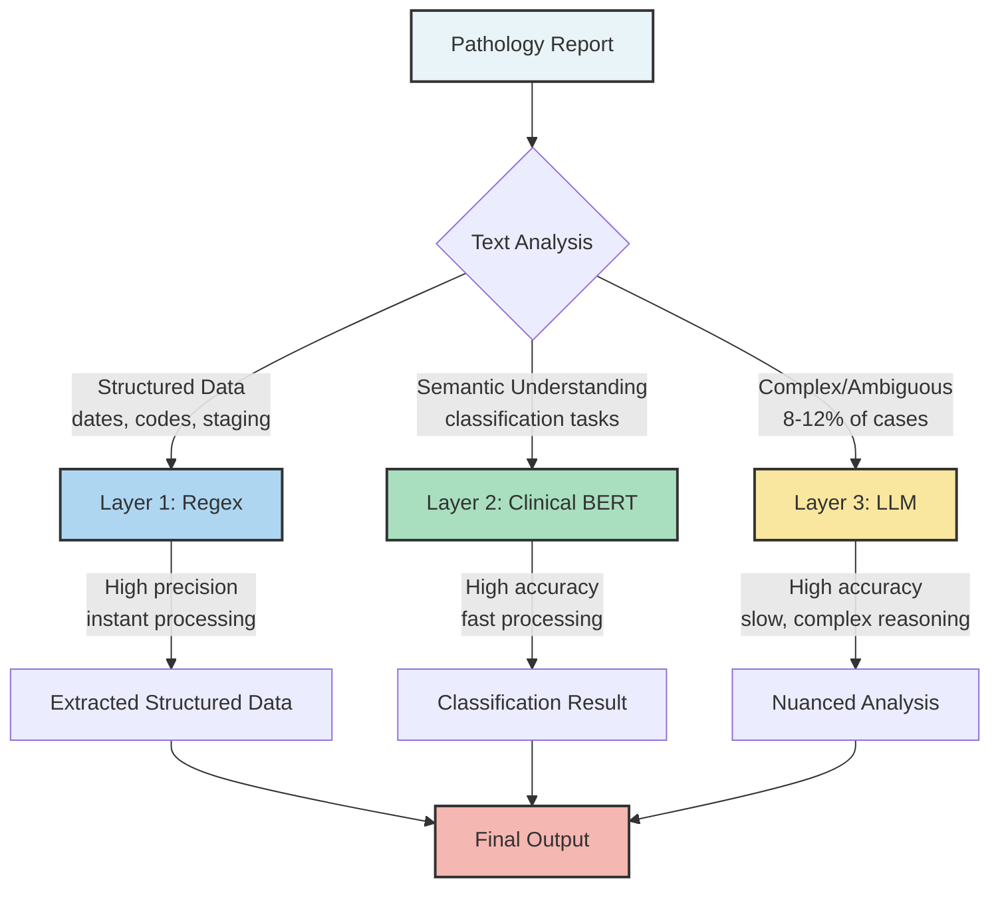
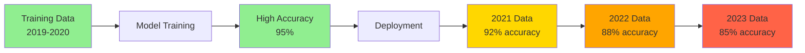
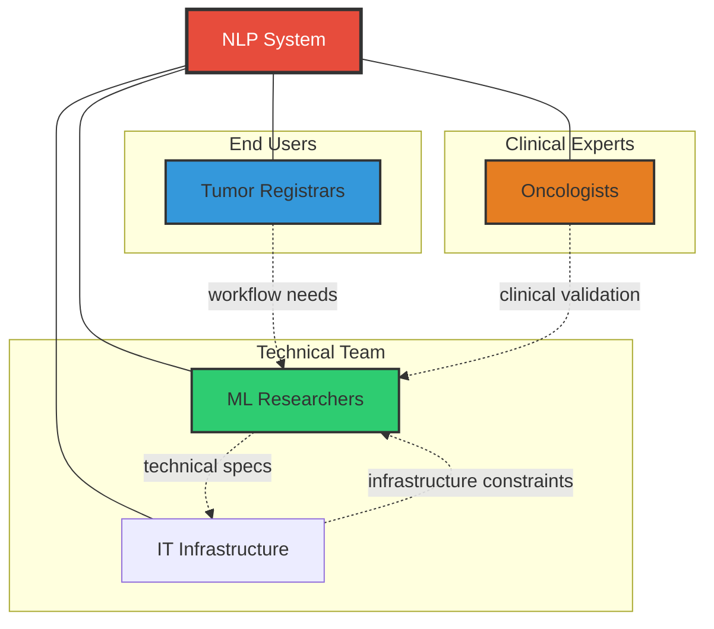

## Introduction

The gap between a Jupyter notebook and a hospital server is not just a matter of deployment engineering—it is a fundamental conflict of objectives.

Machine learning researchers are trained to chase the upper bounds of performance metrics. We want the highest F1-score, the lowest perplexity, or the top spot on a leaderboard. But at the **British Columbia Cancer Registry (BCCR)**, where our team processes millions of pathology reports to track cancer incidence and patient outcomes, we learned that a "perfect" model can still fail to solve the actual problem.

Over four years, we deployed various NLP models—from simple regex patterns to fine-tuned BERT models and Large Language Models (LLMs)—for tasks including tumor reportability classification, cancer relapse detection, anatomical site identification, and report segmentation.

This post shares the unvarnished reality of what worked, what didn't, and why the gap between research innovation and real-world healthcare deployment is wider than most people think.

## The Metric Trap

In standard machine learning tasks, we define success as maximizing a metric like accuracy, F1-score, or Area Under the Curve (AUC). However, in BCCR’s production registry pipeline, the cost functions are asymmetric and tied to human labor rather than model statistics.

Consider our task of **Reportable Tumor Identification**, which involves determining which pathology reports contain cancers that must be tracked by the registry. In the academic view, the goal is simply to maximize the F1-score by balancing precision and recall. But the operational reality is far more complex. Every "Positive" prediction triggers a manual review by a highly trained tumor registrar to finalize the case, while every "Negative" is archived. This creates a high-stakes environment where false negatives result in missed cancer cases, but false positives flood registrars with irrelevant reports, leading to burnout.

We discovered that the metric that actually mattered was **Time Saved Per Report**.

When we analyzed the operational data, the results were counterintuitive. Suppose we have a batch of 1,400 reports where manual processing takes about one minute per document. Without AI, the registrars face 1,400 minutes of work. Our deployed model filtered out the clear negatives, leaving 1,100 reports. If we had only focused on filtering, the savings would be modest. However, by designing the model to perform **sentence-level highlighting**—pinpointing the exact evidence for its decision—we reduced the human review time from 60 seconds to 30 seconds per report.

The result was a total processing time of 550 minutes, a nearly 60% reduction in workload. This highlighted a critical reality: a model with lower theoretical accuracy that integrates effectively into the human workflow (via explainability features) is vastly more valuable than a "State of the Art" black box that achieves marginally higher accuracy but offers no assistive utility.

> **The Lesson:** Don't just optimize for accuracy; optimize for the bottleneck. While ML experts measure success by ROC curves, organizations measure success by backlog reduction. A tool that aids interpretability often yields higher utility than a "black box" with marginally higher accuracy.

## Do Not Use a Cannon to Kill a Fly

With the current hype surrounding Generative AI, there is enormous pressure to throw an LLM at every text processing problem. In our experience, this approach is often computationally wasteful, prone to hallucinations, and less robust than simpler methods.

We advocate for a **Pragmatic Hybrid Architecture**, essentially a waterfall approach where data flows through progressively more sophisticated models only when necessary.

    Figure 1: Our pragmatic hybrid architecture processes reports through layers of increasing sophistication, reserving expensive models for genuinely difficult cases.

The first line of defense is what we call the **"Boring Layer"**: regular expressions. For structured data like dates, histology codes, or tumor staging notation (e.g., "T1N0M0"), regex provides 100% precision with zero hallucinations. It is fast, cheap, and explainable. Extracting "Grade 3" from a standardized field does not require a GPU.

When semantic understanding is required, such as distinguishing between a patient's history of cancer versus a current diagnosis, we escalate to the **"Efficient Layer."** Here, fine-tuned clinical BERT models (like Gatortron or BioClinicalBERT) excel. These smaller, domain-specific models often outperform general-purpose LLMs on focused classification tasks while costing a fraction of the computational budget.

We reserve the **"Smart Layer"**—Generative AI—for the 8-12% of cases that are genuinely ambiguous, require complex reasoning, or involve summarization. This represents a small fraction of our volume but handles the edge cases where simpler methods fail.

Crucially, we found that **Report Segmentation** was an unsung hero. Pathology reports are filled with noise—headers, disclaimers, and legal text. Using a lightweight model to strip this noise and feed only the relevant diagnostic text to downstream models improved performance more than simply scaling up the model size. As is often the case, better preprocessing beats bigger parameters.

> **The Lesson:** Model selection should be pragmatic, not trendy. Match the complexity of the method to the complexity of the problem. If a regex works, use it. Preprocessing (segmentation) often delivers higher ROI than increasing parameter count.

## Data Quality is Everything

In academic datasets, labels are usually treated as ground truth. In healthcare, we learned that labels are often just opinions. When we analyzed our initial training data, we found that label noise was a massive bottleneck; models trained on a single annotator's data were essentially learning that specific person's biases rather than medical truth.

To fix this, we moved to a **consensus-based approach**. We paused modeling to spend weeks strictly defining a "Code Book"—a living document of annotation guidelines. We ran pilot studies where multiple experts labeled the same reports, and where they disagreed, we held discussions to refine the definitions. If human experts cannot agree on the label for a specific report, a model has no chance of learning it correctly.

We also had to contend with the reality that medical data is not static. Terminology evolves, and reporting formats change. A model trained on 2019 pathology reports will inevitably struggle with 2024 reports using new WHO classifications.

    Figure 2: Without continuous monitoring, model performance degrades over time as medical terminology shifts.

This necessitated **Automated Drift Detection**. By monitoring prediction distributions and confidence scores, we can detect when the model becomes less confident or when the data distribution shifts, signaling a need for retraining.

> **The Lesson:** Data quality and representativeness matter more than model sophistication. Invest in a "Code Book" and consensus processes early. Expect your data to drift, and build monitoring systems that alert you when it does.

## Error Handling and System Design

No model is perfect, and in healthcare, "hallucination" is not just a quirk—it’s a liability. We learned that the reliability of a system depends less on eliminating every error and more on how the system handles those errors when they inevitably occur.

We implemented **Confidence-Based Routing** to manage this risk. High-confidence predictions are processed automatically, while low-confidence predictions are flagged for human review. Furthermore, if a report looks drastically different from the training data (out-of-distribution), it defaults to the manual queue.

To ensure long-term safety, we adopted a **clinical-trial design approach to auditing**. Rather than ad-hoc spot checks, we established a rigorous sampling protocol to estimate error rates with statistical significance. Every six months, we conduct a structured audit to ensure the model hasn't silently degraded. Trust in AI is not built on a single high accuracy score, but on the assurance that the system knows when it doesn't know.

> **The Lesson:** Accept that errors will happen and design your system to handle them gracefully. Confidence thresholds, human-in-the-loop validation, and statistically rigorous auditing are essential for reliable healthcare AI systems.

## Privacy as an Architectural Constraint

When working with sensitive patient data, privacy cannot be an afterthought; it must be a fundamental architectural constraint. Large Language Models have a known propensity to memorize training data, which poses a catastrophic risk in a cancer registry. If an adversary could query a model to reconstruct a pathology report, we would have failed our patients.

To mitigate this, we rely primarily on **local, open-weights models** (like Llama or Mistral) hosted entirely within our firewall. Sending patient data to a public API is simply not an option for us. Additionally, we integrated **Differential Privacy (DP)** into our training pipeline. While DP introduces noise that can slightly degrade utility, it provides a mathematical guarantee that individual patient data cannot be reverse-engineered from the model weights. We accept the slight trade-off in performance for the absolute necessity of privacy.

> **The Lesson:** Privacy must be integrated into the development lifecycle, not added at the end. Prefer local, offline models for sensitive data, and evaluate the trade-off between Differential Privacy guarantees and model utility.

## Co-Design and AI Literacy

We had a significant structural advantage: we are the provincial cancer registry, meaning our team includes ML researchers, tumor registrars, and oncologists working side-by-side.

This collaboration forced a critical pivot in our project. Initially, our goal was purely technical: "Create an NLP solution that is 99% accurate." However, after sitting down with the registrars and understanding their daily struggles, we realized that accuracy wasn't their primary pain point. Their problem was the **24-month backlog**.

We revised our goal to "Reduce the backlog by 50%," which changed our entire technical roadmap. Instead of building a black-box classifier to replace humans, we built an assistive tool that highlights evidence to speed them up.

    Figure 3: Successful deployment required alignment across multiple groups. Without registrar input, we would have solved the wrong problem.

This co-design process also required investing in **AI Literacy**. We couldn't just drop an AI tool on clinical staff and walk away; we had to teach them how the models worked, where they failed, and why they made certain predictions. When domain experts understand the "black box," they trust it more and become better at catching its errors.

> **The Lesson:** Involve end-users from Day 1. Co-designing the solution ensures you are solving the business problem (backlogs), not just a technical problem. Furthermore, educating your users about AI capabilities and limitations builds the trust required for adoption.

## The DARE Framework

Many healthcare organizations lack in-house ML expertise and opt to buy off-the-shelf AI tools. This is often risky, as a vendor's "99% accuracy" claim is usually based on their clean, curated dataset, not your messy real-world data.

To help organizations navigate this "Build vs. Buy" decision, we propose the **DARE framework**:

*   **D - Demand Robust Validation:** Do not accept whitepapers as proof. Demand validation on *your* local data distribution. Vendors should be willing to run their model on your data to prove it works in your specific context.
*   **A - Assess Flexibility:** Can the tool handle your specific quirks, such as local report formatting or unique abbreviations? Can it be fine-tuned when standards change?
*   **R - Rigorous Internal Compatibility:** Does the tool introduce fairness biases regarding your specific patient demographics? Does it integrate seamlessly with your existing IT infrastructure?
*   **E - Ease of Evaluation:** Avoid black boxes. Can you audit the logs? Does it provide confidence scores? Can clinical staff override the AI when needed?

> **The Lesson:** Be skeptical of "plug-and-play" AI. Use the DARE framework to validate vendor claims on *your* specific data before committing resources.

## Conclusion

The journey from academic machine learning to deployed healthcare AI requires rethinking many of the instincts we developed in grad school. We learned that the solution saving the most time isn't always the one with the highest accuracy on a held-out test set, and that "boring" tools like regex often outperform the latest LLMs on structured tasks.

Most importantly, we learned that deployment cannot be an afterthought. It requires deep collaboration between researchers and domain experts to ensure we are solving the right problems. By prioritizing workflows over metrics, respecting data privacy as a hard constraint, and demanding rigorous validation, we can bridge the gap between research and production.

In machine learning conferences, SOTA means topping the benchmark. In healthcare, true SOTA is a system that runs reliably, respects patient privacy, and clears the backlog so patients get treated faster.

**The real SOTA is AI that works.**
